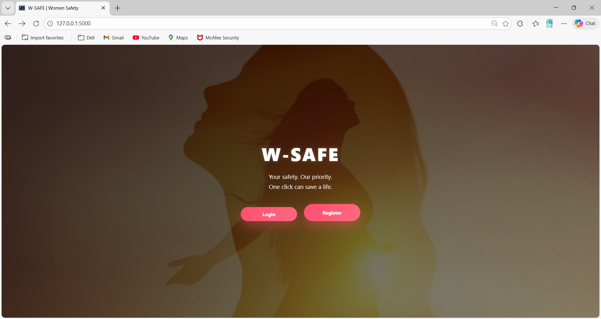
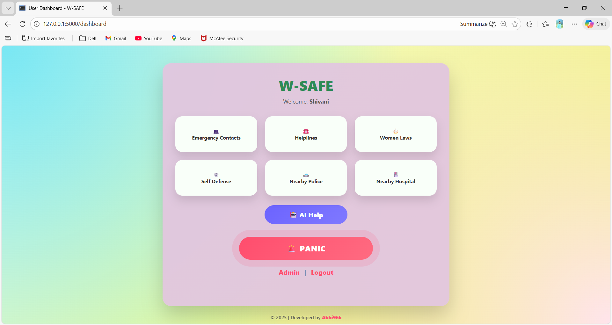

# 🚨 W-SAFE – Women Safety Web Application

W-SAFE is a women safety web application built using Flask.
It helps users during emergencies with SOS alerts, AI-powered assistance,
and quick access to nearby police and hospitals.

---

## 🔹 Features
- User & Admin Authentication
- Emergency SOS Panic Button
- Live Location Sharing
- Emergency Contacts Management
- Nearby Police & Hospital Finder
- Women Safety Laws & Self-Defense Tips
- AI Safety Assistant (Chat-based)
- Admin Dashboard for SOS Monitoring

---

## 🛠 Tech Stack
- Frontend: HTML, CSS, JavaScript
- Backend: Python (Flask)
- Database: SQLite
- AI Integration: OpenAI API
- Maps: Google Maps

---

## 📸 Screenshots

### 🤖 Login


### 🏠 User Dashboard


### 🚨 Admin SOS Monitoring Dashboard


---

## 🚀 How to Run the Project
```bash
pip install -r requirements.txt
python app.py
